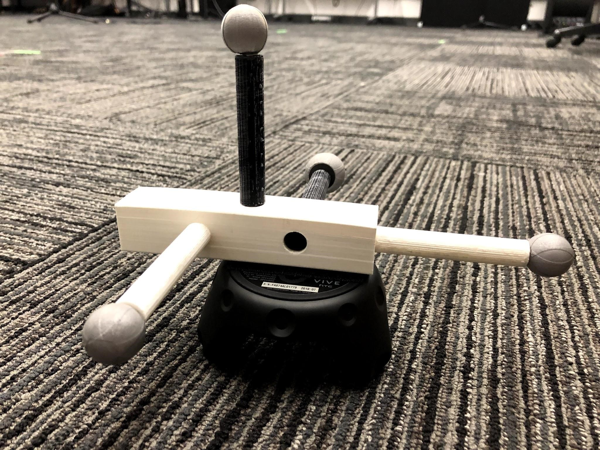
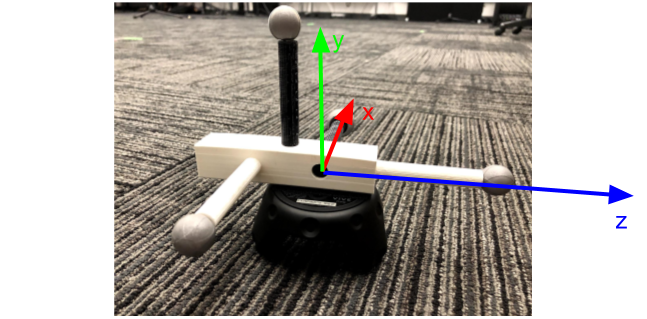
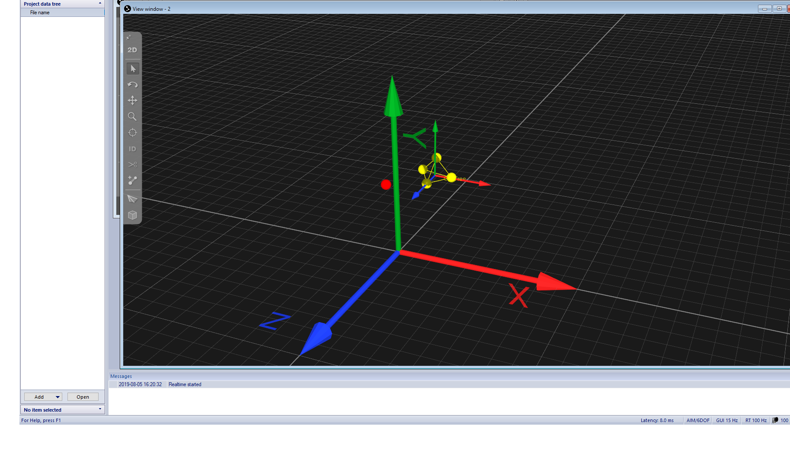
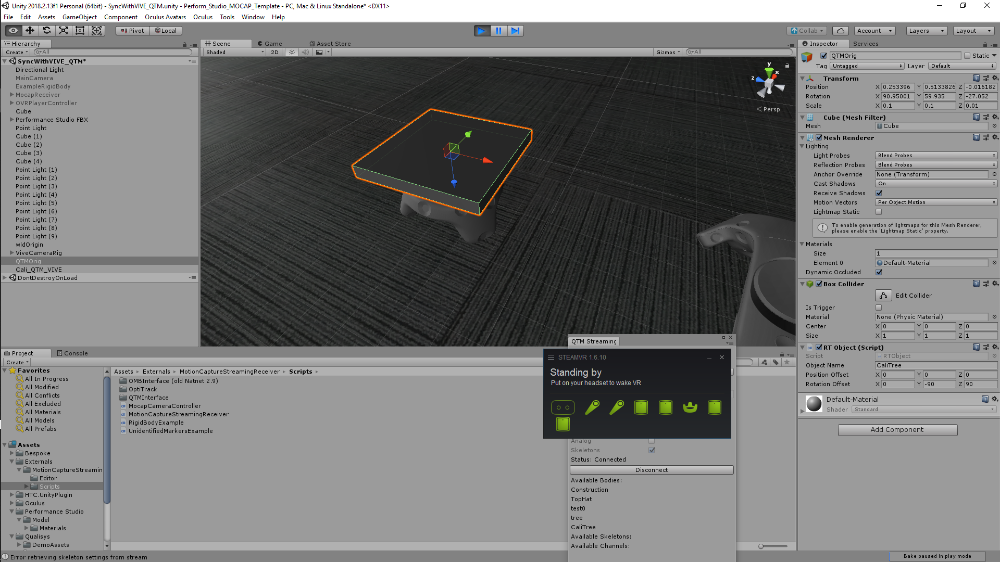
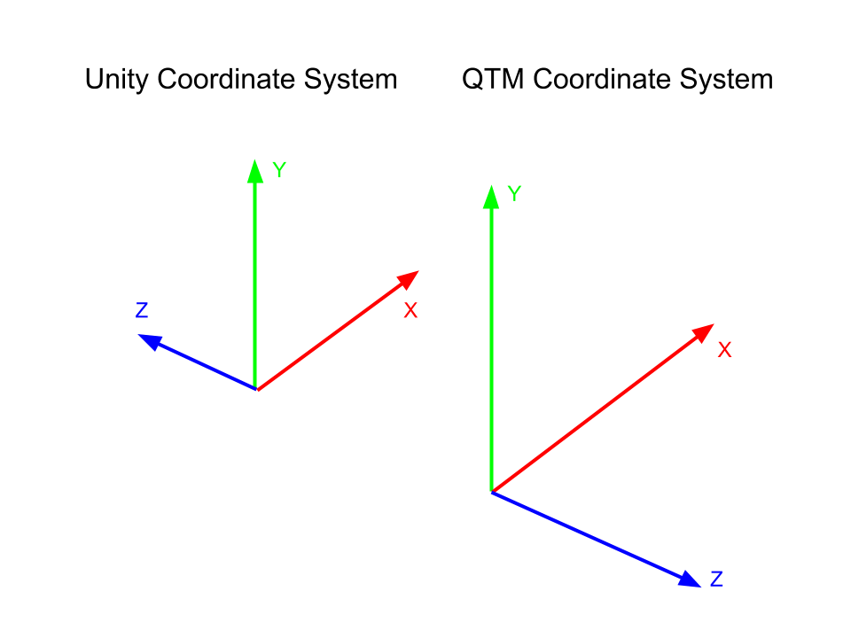
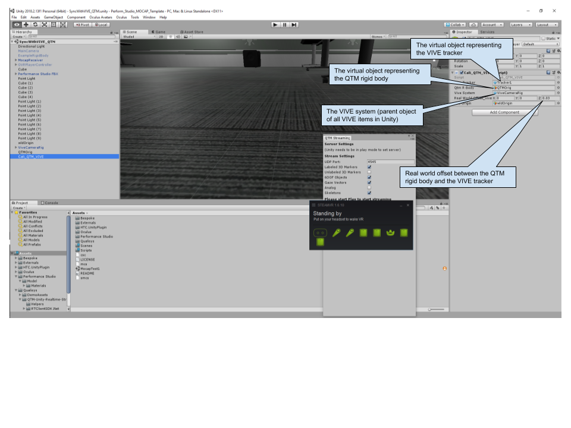
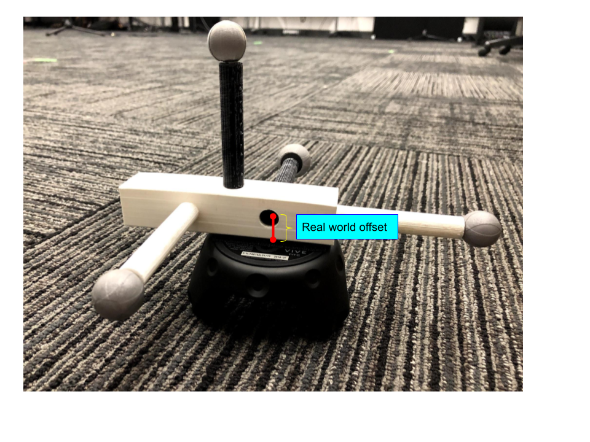
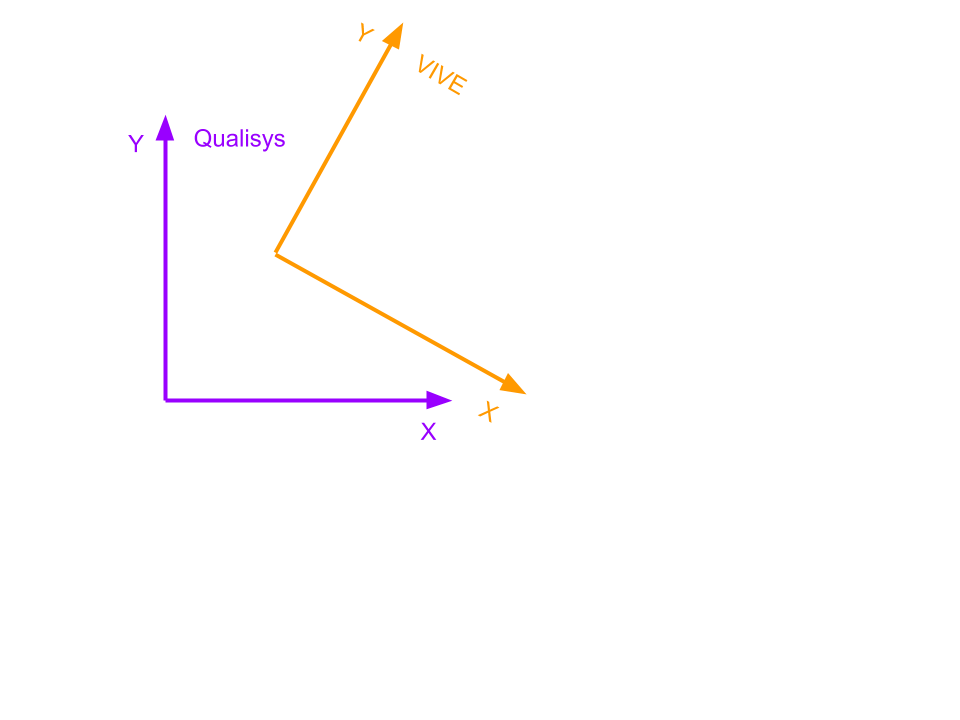
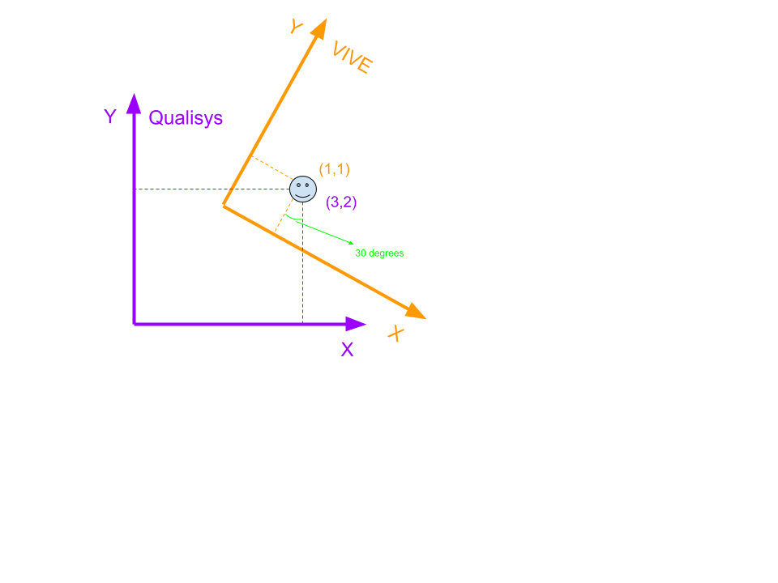

# QTM_Vive_Peform
QTM Integration for Unity in Perform

 Combine Qualisys with HTC VIVE

Run Yu   runyu@vt.edu
## Introduction
  This is a tutorial about how to combine the Qualisys motion tracking system with the VIVE VR system. The goal is to let you use the VIVE headset, controllers and trackers just like usual, while also having extra items tracked by the Qualisys system co-exist in the same virtual environment (VE). In this way, you take advantage of the high-quality display of the VIVE system without losing the flexibility of tracking custom-made objects (e.g. you can even track full human bodies with the Qualisys system). We think this kind of setup would be ideal for the CUBE. 
  To bring the two systems together, the general idea is to have a physical prop co-tracked by the two systems simultaneously, and we use this prop as a reference to bring the two separate coordinate systems to the same virtual environment in Unity. Section 2 is a quick start guide, which is what I could build and test in the Perform studio during summer 2019. Using this guide, you can quickly create a scenario that you use the VIVE headset to walk in a VE while holding a rigid body tracked by the Qualisys system. The biggest problem of this guide is the lack of accuracy. Bringing the two systems together is a calibration process, and all the steps in Section 2 is based on me eyeballing everything. The result of this inaccuracy is that you may see the rigid body tracked by Qualisys being offset by a certain distance (or angle) in the VE compared to reality. Hence, I’ve also written a Section 3 to explain the ideas behind Section 2 and how one could potentially follow up to improve upon the current procedure. 
  
## Description

This document describes how to create a new project in Qualisys Track Manager (QTM) in the Cube, in preparation for motion capture.

## How to read this document

The higher level bullet points outline the general workflow without providing details on how to accomplish each step. If a bullet point seems unclear, read the sub-bullets for step by step instructions.

Text in red indicated instructions are incomplete and need to be written.

## Software

This document was written with the following software versions and may not be applicable for later versions:
●	Qualisys 2.12

# 1.1 Qualisys Track Manager - How To - Create a New Project

## Instructions
### 1. Log in to either Nermal, the PC desktop computer in the Cube or ImmersiveMediaPerform in Perform (see password document)

    * Open Qualisys Track Manager

    * A dialogue window titled “Open Project” will pop up.

    * Click “New project…”

### 2.In the Project Name text field, type a short but descriptive name for your project.  

    * If the project doesn’t have a name, you might use the name of the project’s Primary Investigator.

    * The project folder path will be D:\QTM_Projects\Qualisys.  

# 1.2 Qualisys Track Manager - Calibration 

## Instructions

### 1.	QTM setup

- Open QTM.  We use the WintermesterQTM project as the default calibration project. Open it from the desktop.
- Start a new measurement.  File->New.  Or the New icon in the upper left of the screen.

### 2.	Masking

- The first step of calibration is to mask the visible light sources.  

  * The cameras can see each other’s IR emitters, but we don’t want the light from those emitters to be considered as potential markers.

  * So, the QTM software’s first calibration step is to ignore those areas of the camera view.

- Clear the floor, and hide all other markers.  

	* Make sure there is nothing in the capture volume that could potentially block the cameras’ fields of vision.  

	* Hide all potentially reflective objects, especially markers, behind the curtain.  Make sure the doors to the equipment cabinet are closed.  

	* Try to make the space as empty as possible.

- In QTM, on the far right hand side, press the “Auto-Mask” button.  This will create up to 5 masks for each camera, covering the light sources currently detected.  

  * If there are more than 5 visible light points on for a camera, a pop up message for that camera will come up, saying something like, “To cover the detected markers, 6 masks are needed.  1 marker masks were omitted, since the maximum number of masks is 5.”  

  * 1 or 2 unmasked cameras is fine.  If this pop up indicates that numerous masks were omitted, there may be a problem.

### 3.	Wand wave

- The next step of calibration is the wand wave, which, in conjunction with the origin L-bracket, allows QTM to determine the position and rotation of the cameras, the position of the floor, and the orientation of the 3D virtual space.

 	* Acquire the calibration wand and origin L-bracket, which should be stored in or around the closet in the Perform studio or in equipment cabinet in the Cube.
 
- Assemble the L-Bracket, and place it on the floor in the center of the room

	 * In the Cube, the center of each wall is demarcated by a strip of red tape on the first balcony, visible from the ground floor. Use these as guides to find the rough center of the room. From there, look on the floor for 5 small blue dots in a circle, marking the exact center of the room. It is preferable that you arrange the L-Bracket so that the long end (with 3 markers) is pointed toward the back wall of the room. 

 	* In Perform, there is a taped pattern in the middle of the room oriented away from the main door, and the bracket can follow this guide, with the long side parallel to the right wall.

 	* Align the bracket towards the Z+ direction in virtual space. While this is not mandatory, if everyone follows this arrangement it will make debugging and following the instructions of the rest of this guide easier.
 
 - Assemble the wand

 	* In QTM, open the Calibration window by opening the Capture drop down menu at the top of the screen and selecting Calibrate, or click the icon that looks like the wand.

 	* Set the calibration time to somewhere between 90 and 150 seconds. 90 seconds is probably enough, but if you like to be more relaxed, 150 seconds should give you plenty of time.

- Hit OK, and QTM will start the calibration process. Pick up the wand and start waving it.

	* The goal is to make the wand cover the maximum amount of space, in 3 dimensions, and to be seen by all cameras at each location.

 	* *BE CAREFUL* with the wand.  The distances between markers on the wand are exact, so don’t drop it or fling it around, or scrape it against the wall, etc…

 	* After the allotted time, the calibration will complete and you can stop the wand wave.  Once the calibration is complete, QTM will process the calibration data. 

 	* A dialogue box will pop up, indicating that the calibration has either succeeded or failed.  

 	 * If the calibration fails, check the volume to make sure there are no reflective objects in the space and try again.  If the calibration continues to fail, contact an ICAT representative.

# 1.3 Qualisys Track Manager - Rigid Bodies

## Instructions

### 1. Create a physical rigid body:

- Attach markers to the object you want to track in such a way that they will not move in relation to each other.  This can be done with double sided tape, velcro, glue, or any other mechanism you prefer.

    * There should be at least 4 markers on each object you want to track.

    * The markers should be spread out with at least 4-5cm between them.

    * The markers should be spread out in 3 dimensions.  They should not form a line or a 2D plane.

### 2. Place the rigid body in the capture volume:

- Place the rigid body near the center of the capture volume, preferably up off the floor (like on a table). 

    * The object should be as immobile as possible. Just having someone hold it can make the rigid body definition more difficult or impossible.

    * If orientation will matter in your project (as opposed to just position), aim the rigid body in the Z+ direction (toward the rear wall of the Cube, if you are following these guides)

### 3. Prepare Qualysis Track Manager (QTM)

- Open QTM.

    * Open your project, or create a new one

    * Calibrate QTM

    * Start a new measurement by clicking on the icon in the upper left that looks like a New File icon

- Set 2D view to Marker mode

    * In the View Window, which is the main center display window, go to 2D view.  

    * 2D mode shows a series of 24 screens. If you are in 3D view, the toolbar on the left will have a button marked 2D to switch to 2D view. If you are already in 2D view, the button will say 3D, which will allow you to switch to 3D mode.

    * On the right hand side of the view window in the properties window, make sure that QTM is in Marker mode. If it is not in marker mode, it will not correctly resolve the markers into trajectories (3D points in virtual space).

### 4. Check for trajectories in 3D view

- In the View Window, go to 3D view.

    * Navigate the virtual space using the mouse

    * Mouse wheel scroll - zoom in / out

    * Right click + drag - pan

    * Left click + drag - rotate

- Look through the virtual space for red dots (trajectories) representing the markers of your rigidbody.  

    * If you move the rigidbody in physical space, you should see the markers move in the virtual space.

-  Make sure all the markers are resolved as trajectories (visible as dots in the 3D view), and that they are not flickering too intensely.

- If the markers are not all resolved or they are flickering try:

    * Move the rigidbody to another location in the capture volume
    * Place the rigidbody on a table that gets it up off the floor
    * Refine the calibration or recalibrate the system
    * Rearrange the markers on the object.
    * Contact an ICAT representative

- There may be other red dots in the 3D view not associated with your rigidbody.  These are most likely artifacts from the cameras seeing each other’s IR emitters.  If there are only a few of them, it shouldn’t be a problem.  If there are a lot of them, recalibrate the system, or contact an ICAT representative.

### 5. Capture a short take

- Go to the Capture drop down menu at the top of the screen, and select Capture, or click the Capture icon.

    * Set the capture period to 3 seconds.

    * You do not need to use “Stop on button only”, “Use capture delay” or “Use sound notification on start and stop,” so you can safely leave those unchecked.

    * Make sure that “Save captured and processed measurement automatically” is checked.  The Folder should be set to your project by default.
   
    * Set the Name to something that makes sense.  For example, if you are creating a rigid body that will be associated with the Oculus Rift, you might call it “Rift_1” or something similar.

    * Hit OK.

- QTM will take a short 3 second capture.  The rigid body does not need to move, nor should it move.

    * When the take is complete, QTM will automatically close the live measurement and open the captured take.

### 6. Process take

- Delete any trajectories that do not represent the markers of your rigidbody

    * If the Unidentified Trajectories window is not already open, go to View -> Trajectory Info -> Unidentified to open it. Here you can see a full list of all the trajectories in your take that have not yet been identified as belonging to rigid bodies. 
    * Click on each of the unidentified trajectories.  The selected trajectory will turn white in 3D view, indicating it is selected.  Delete any trajectories that are not part of your rigidbody.  If there are multiple trajectories right on top of each other, you may need to recalibrate.
 
### 7. Create a rigid body

- Select the trajectories that represent the markers of your rigidbody. Click and press delete

- Right click on any of the trajectories. In the resulting menu, click **“Define rigid body (6DOF)”**

- Enter the name for your rigidbody.  This is also the name for this rigid body that will be streamed to any receiving application.  

    * For example, if you are creating a rigid body that will be associated with the Oculus Rift , you might call it “Oculus_1.”  Capitalization matters.
 
- The dots should now turn a different color representing your rigidbody, and have lines connecting them

- Close the measurement.  You do not need to save the changes you made, as the rigidbody was automatically added to the 6DOF Tracking rigidbody set for the project.

### 8. Test the rigidbody

- Open a new measurement

    * In the 3D view, you should now see a live view of your rigid body with lines connecting the trajectories

- Customize the rigidbody

    * Go to Tools -> Project Options
    * In the menu on the left, go to Processing -> 6DOF Tracking
 
- The 6DOF Tracking options list all the defined rigid bodies in your project

    * Select the rigid body of interest
    * Using the menu on the right, you can change the color of the trajectories in the 3D view and do any other necessary adjusting to the translation, rotation, or coordinate system.
    
# 1.4 Qualisys Track Manager - Troubleshooting

## Issues

### Issue: Cameras Stuck Syncing

## Resolution

- Reboot the cameras remotely

    * In the windows tray on the bottom right corner of the screen, find the QTM icon
    * Right click on the icon, go to ….
    * Wait a few minutes.  Be patient
    * In QTM, open a new measurement
    * If the cameras get stuck syncing again, proceed to step 2

# 2.1 Connect QTM with Unity

1) Calibrate the Qualisys system as usual, remember to make the Y axis pointing up in the world coordinate system. If you are not sure, there is a QTM project called “RunTest” on the computer that’s connected to the QTM system in Perform studio. Directly use that project or follow the settings in that project.

2) Make sure you have this physical prop by your hand (shown in the picture below). This prop combines a QTM rigid body and a VIVE tracker together, and it’s specifically built to synchronize between QTM and VIVE. 

3) If you are not directly using the “RunTest” project in QTM, you need to define the rigid body on this physical prop in the QTM software. Make sure you define it in the way shown below (notice how QTM uses a right-handed system). Give the rigid body a name and remember it (you’ll need to put it in Unity later).

4) Initialize a blank Unity project, download the QTM Unity package from the repo of Qualisys https://github.com/qualisys/Qualisys-Unity-SDK

5) Import that Unity package into your project. This should create a folder called “Qualisys”.

6) Create a small 3D object (e.g. a cube) in the Unity scene, which would represent the QTM rigid body on the physical prop. 

7) Drag the “RTObject.cs” script (in Qualisys/QTM-Unity-Realtime-Streaming/Streaming) onto this gameobject. Put the rigid body’s name you defined earlier in QTM in the field of “Object Name”. This would make this Unity project receive real-time motion tracking data from QTM and use that to move this 3D virtual object in Unity. Also, give the “Rotation Offset” field a -90 at the Y field and a 90 at the Z field, as shown in the picture below (in this picture the 3D virtual object representing the QTM rigid body is a “slab” called “QTMOrig”). 

*Note: QTM uses a right-handed system while Unity is left-handed. When using this Unity package from QTM, my experience is that it’s helpful to think that the QTM world coordinate system and the Unity world share the same x axis, as shown below.*

8) Now test if QTM works with Unity. On the top menu of Unity, press “Window” -> “Qualisys” -> RTClient, which should bring up a QTM panel. Press “Play” in Unity Editor to start the application, and then click “connect” on the QTM panel. The computer that runs this application needs to be in the same LAN environment with the QTM server computer to make this work. If it works correctly, you should be able to move the physical prop around in reality while seeing the 3D virtual object (with the script “RTObject.cs” attached) follow your movement. 
*Note: you’ll need to click “connect” every time you run the application when using this Unity package provided by Qualisys.*

### 2.2 Connect VIVE with Unity

1) Next we need to connect this Unity project with the VIVE system. Just do the regular things that would make VIVE work with Unity. What I was using was the “VIVE Input Utility” from Unity Asset Store. https://assetstore.unity.com/packages/tools/integration/vive-input-utility-64219. It has a prefab that directly includes the VIVE trackers. Download this package and put a “ViveCameraRig” in the Unity scene and make sure its position is at world origin (0,0,0). Also, don’t forget to enable “Virtual Reality Supported” in the “XR setting” of Unity. 

2) Test if VIVE works. Press “Play” and see if the HMD and tracking works. 

3) More specific to our setup is that we need to make sure the VIVE tracker on the physical prop is properly tracked and displayed. Depends on how you calibrated the VIVE system, you may need to rotate the “ViveCameraRig” to align it with the Unity world and with the Qualisys world. **Test this by moving the physical prop to see if the tracker and the 3D item representing the QTM rigid body move in the same direction in the Unity scene (note that they are not likely to be co-located since it’s likely that the Qualisys and VIVE systems don’t share the same world origin based on the separate calibration processes).** If not, you’ll need to rotate ViveCameraRig accordingly. In my testing in Perform, I had to rotate the ViveCameraRig by -90 degrees, as shown below. 

### 2.3 Synchronize QTM with VIVE

1) Create an empty GameObject in the Unity scene. Attach the script “Cali_QTM_VIVE.cs” to it. You should be able to find the script in a folder called “code” in the directory of this tutorial. The rest of this sub-section is illustrated in the picture below.

2) Drag the object representing the VIVE tracker to the field of “Vive Tracker”

3) Drag the object representing the QTM rigid body to the field of “Qtm R Body”

4) Drag the object representing the VIVE system (the parent of all VIVE objects in the scene, the ViveCameraRig if you are using it) to the field of “Vive System”

5) The value of “Real World Offset Vive Minus QTM” should be determined by the distance between the VIVE tracker and the QTM rigid body on the physical prop, as shown below. You can give it a (0, 0, 0.03) approximately. 

6) Run the project and at any time press space bar, which should instantly align the QTM system with the VIVE system (you should see your viewpoint “jump” to a new location at the moment you press the space bar).  

## 3. The Long Story
  In this section I’ll explain the idea behind this calibration process, so you could create a better and more accurate one. Again, the basic idea is having a physical object co-tracked by the two systems together, so we can use this object as a reference to synchronize (position and orientation wise) them in a Unity project. 

  Because you calibrate the VIVE and the Qualisys systems separately, they have different origins and orientations relative to the real world. For example, a 2D version of such difference is illustrated in the picture below. This discrepancy between the two coordinate systems needs to be accounted for in the Unity project, so objects tracked by the two systems separately would have the same position and orientation data in the Unity scene when they are placed at the same location and orientation in reality (even though the two systems report different numbers). This is done in Unity by placing the parent of all VIVE objects at a location and orientation relative to the parent of all QTM objects so that the offset between these two parents matches the offset between the two coordinate systems in the real world. In the example shown in the picture below, the parent of the VIVE objects (e.g. the “ViveCameraRig” if you are using the Unity package provided by VIVE) should be placed on the top right of the parent of the QTM objects, with a clockwise rotation. 

Now the question is how can we know this offset? This is where the “co-tracked” physical prop comes in. When you have such an item tracked by both systems, you can calculate this offset using the different numbers reported by each system. Take the same 2D example, let’s say you have the “smiley face” object tracked by both systems (shown in the picture below). QTM is reporting that it is at location (3,2) with an orientation that’s Quaternion.identity, while VIVE is reporting that it is at location (1,1) with an orientation that’s with 30 degrees of counter-clock rotation relative to Quaternion.identity (Note this is looking at the object from the perspective of the VIVE system). From these numbers, you can easily figure out that the VIVE coordinate system is placed at the upper right of Qualisys, with a positional offset of (2, 1), and it’s rotated clockwise by 30 degrees relative to Qualisys. Then you can use these numbers to place the parent of the VIVE objects relative to the parent of the QTM objects in the Unity scene. This is what we mean by “using the co-tracked object as a reference to bring the two coordinate systems together”. This is also the idea behind the entire Section 2. If you check the short code of “Cali_QTM_VIVE.cs” used in Section 2, it does exactly what’s just explained. 

Now the unsolved problem is: how to do this accurately? In reality, we don’t have an item that could be co-tracked by both systems, since VIVE only tracks the several devices built by HTC while Qualisys only tracks rigid bodies that are explicitly built with the reflective balls. This is why I built that physical prop that stick a VIVE tracker with a QTM rigid body together. Doing so introduces a lot of potential errors. For example, the two items (i.e., the VIVE tracker and the QTM rigid body) may not be aligned perfectly, which introduces an offset for orientation between the two. Such orientation errors are particularly bad, since they can turn in to huge discrepancies in translation (Imagine you are using a laser pointer to point to a location on a wall that’s 10 meters away, rotating your hand by 1 degree could result in the red dot moved by 1 meter or more on the wall). The two items also have a positional offset between them, and this is why there is a field called “Real World Offset Vive Minus QTM” (Section 2.3) in the calibration code. Ideally, you should have the accurate measurement of this offset in real world and put it in the code, but I did all these by eyeballing and approximation in Section 2. **To make a millimeter-accuracy calibration, all these potential errors need to be accounted for.**

### Side Notes

- Use the USB to USB wire for starting up Wireless Vive
- To Charge battery for the Wireless Vive use the USB to USBc wire

    
My hope of writing this is that:

1) By following Section 2, you can have a rough calibration that brings the two systems together. You can wear a HTC VIVE headset and hold a Qualisys-tracked item in your hand, and you’ll see the virtual representation of that item roughly resides in your hand. This should be enough for a lot of demos that don’t require high accuracy. 

2) By understanding the ideas explained in Section 3, you can improve upon the process and create a more accurate version of this.

Worst case scenario, shoot me an e-mail and I’ll try to help :-)
